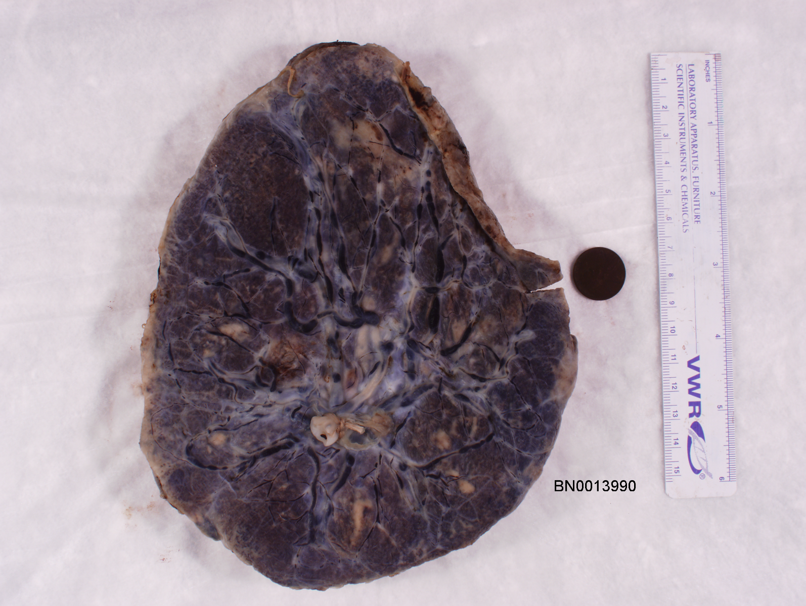
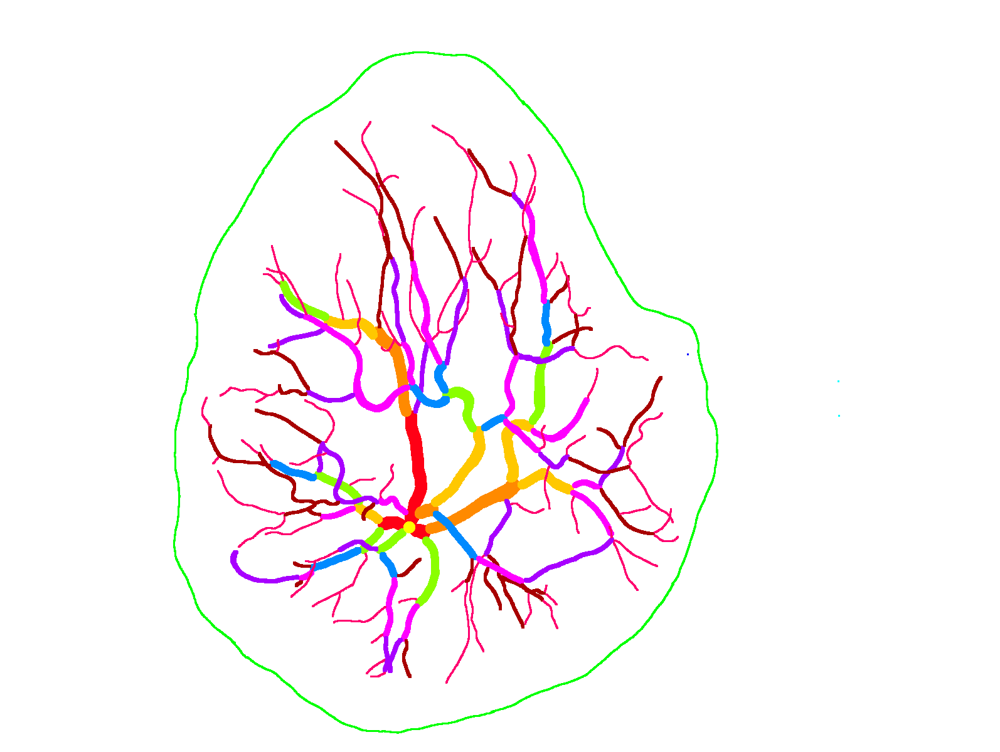
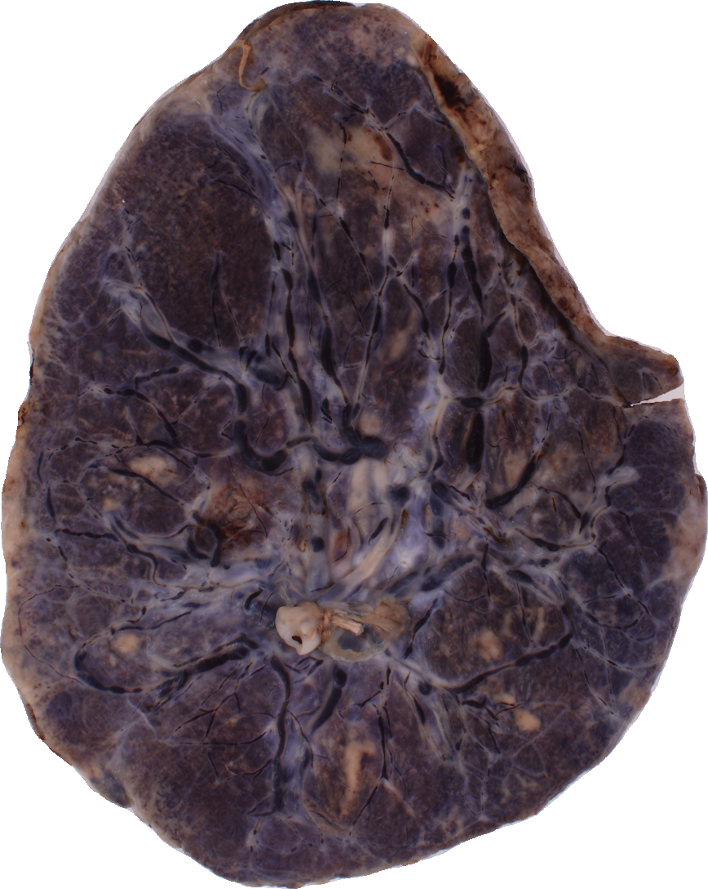
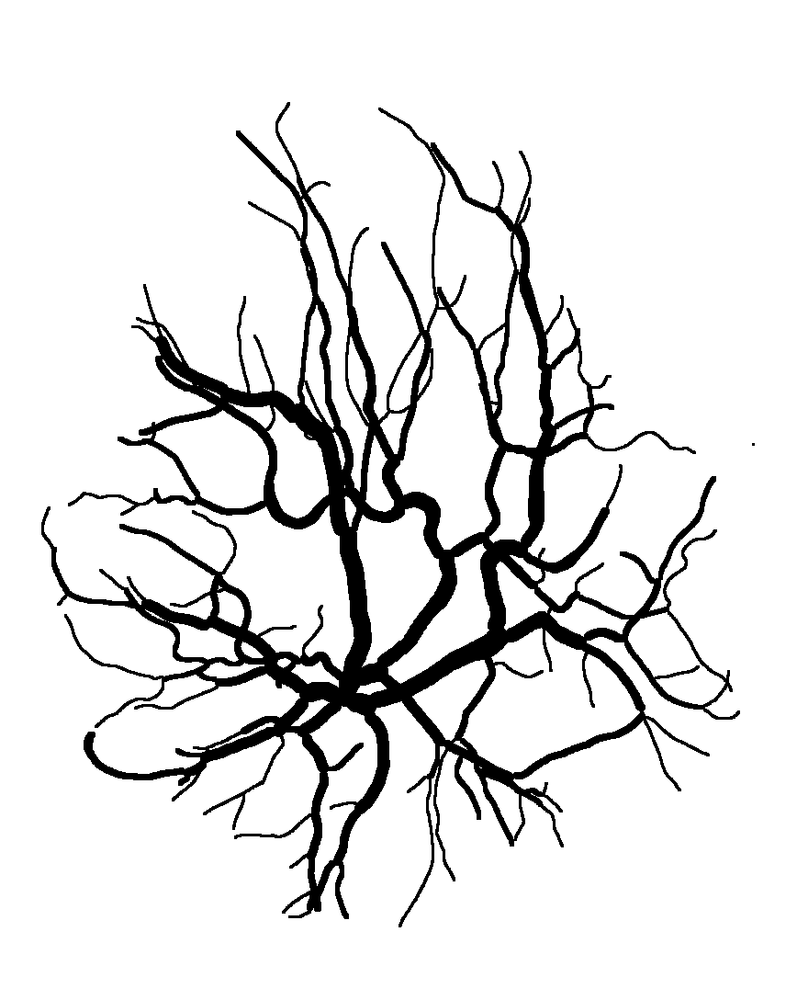

## Background

You can use the [editor on GitHub](https://github.com/canghel/placenta/edit/master/docs/README.md) to maintain and preview the content for your website in Markdown files.

Whenever you commit to this repository, GitHub Pages will run [Jekyll](https://jekyllrb.com/) to rebuild the pages in your site, from the content in your Markdown files.

## Data pre-processing

### NCS Dataset

The raw placenta images we began with are pairs of photos and manually traced arteries and veins for each placenta.

   <kbd></kbd>  
<br/><br/>  


The first step is to adjust the background, crop, and convert the trace to black and white.  
<br/><br/>  

   <kbd></kbd>  

<!-- ```markdown
Syntax highlighted code block

# Header 1
## Header 2
### Header 3

- Bulleted
- List

1. Numbered
2. List

**Bold** and _Italic_ and `Code` text

[Link](url) and 
```

For more details see [GitHub Flavored Markdown](https://guides.github.com/features/mastering-markdown/).

### Jekyll Themes

Your Pages site will use the layout and styles from the Jekyll theme you have selected in your [repository settings](https://github.com/canghel/placenta/settings). The name of this theme is saved in the Jekyll `_config.yml` configuration file.

### Support or Contact

Having trouble with Pages? Check out our [documentation](https://help.github.com/categories/github-pages-basics/) or [contact support](https://github.com/contact) and we’ll help you sort it out. -->
