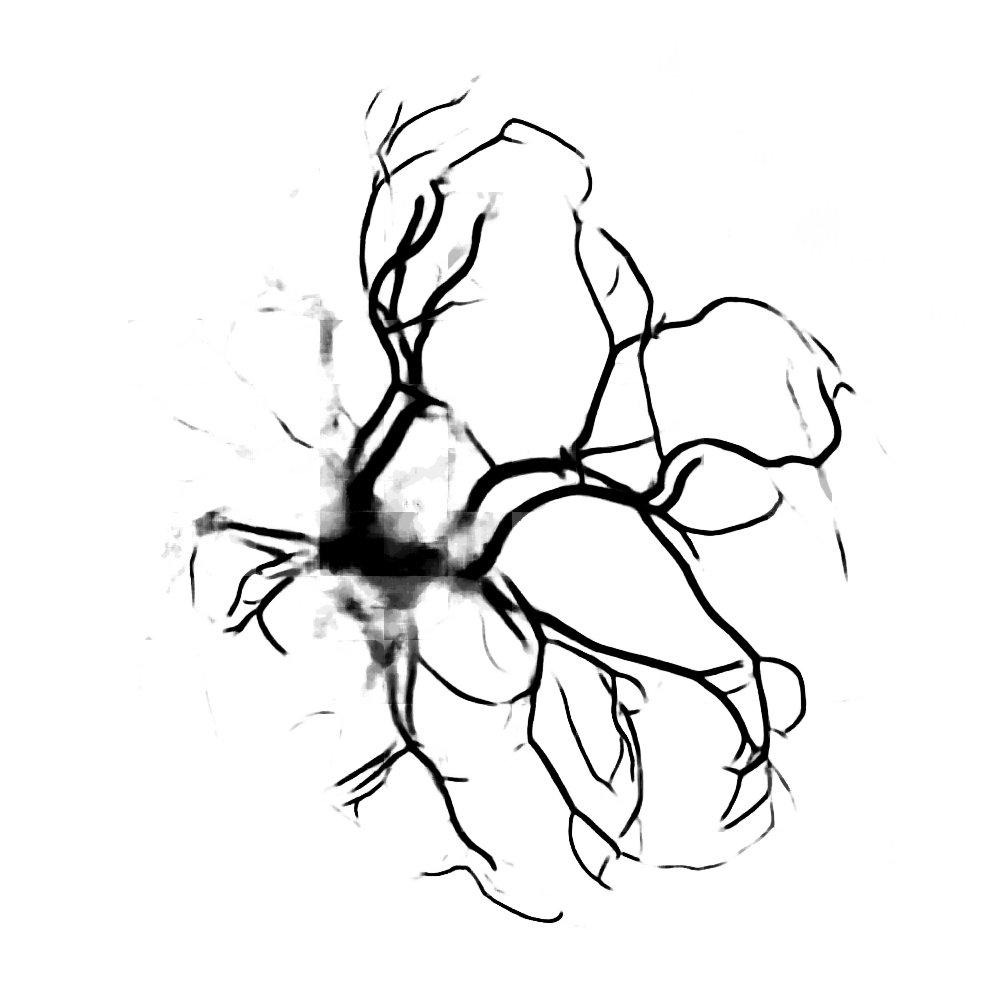
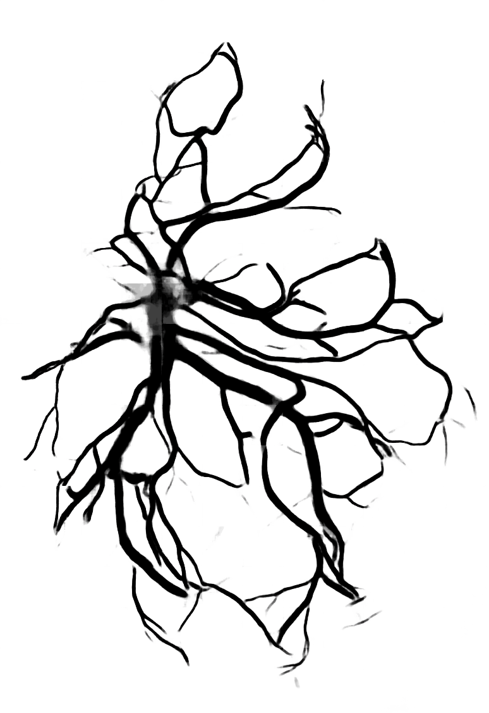
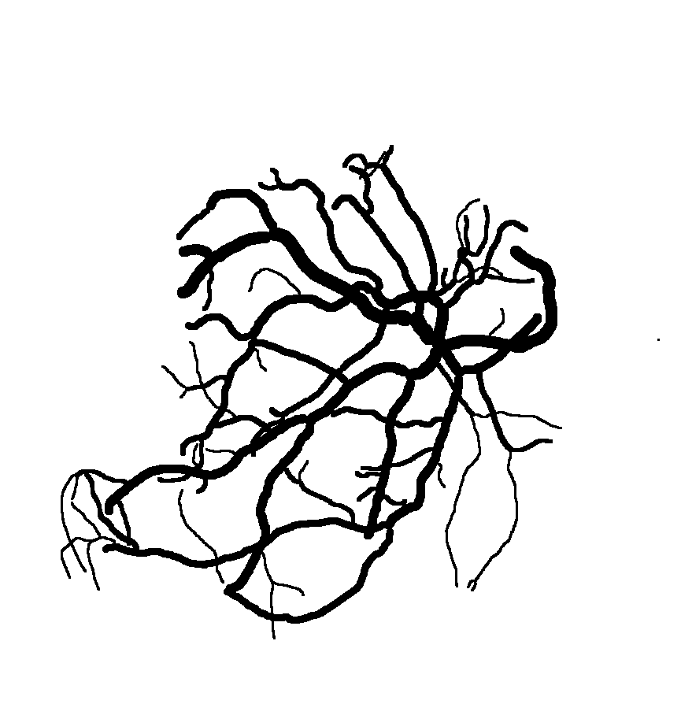
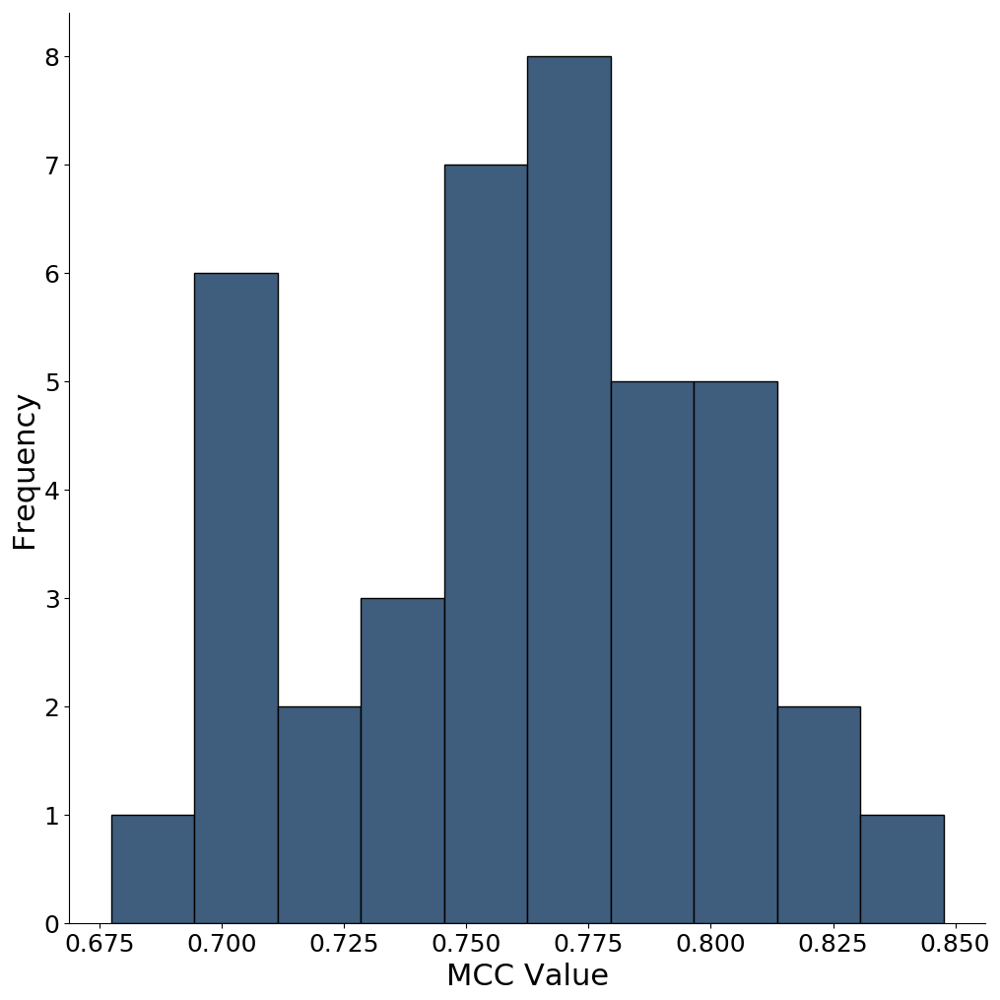

## Introduction

The overaching goals of our work are to:

*    distinguish the features of the placental chorionic surface vascular network which are associated with increased risk of Autism Spectrum Disorder (ASD) [[1](#ref-Chang2017)], and

*    explore the effect of these features on function, in particular on oxygen transfer efficiency.


As a prerequisite to our first aim, we must extract the vascular network structure from photo images of the placenta.  The images here are taken either at delivery or upon pathological evaluation and are noisy due to the complexity and variation of the tissue itself (e.g. as compared to retinal vessels, say), as well as to the variation in photographic equiment, lighting, etc.  Manual extraction of the vascular network is time-consuming and expensive.  Thus, our goal here is to

*    improve the automatic extraction of the vascular network structure. 

The following is the documentation of the code for the neural network portion of our project.  For the full background, methodolgy and results, please see the following two articles (under review):

>  C. Anghel, K. Archer, J.-M. Chang, A. Cochran, A. Radulescu, C.M. Salafia, R. Turner,
K. Yacoubou Djuma, L. Zhong, "Placental vessel extraction using shearlets, laplacian eigenmaps
and a conditional generative adversarial network," Springer, 2018

>  C. Anghel, K. Archer, J.-M. Chang, A. Cochran, A. Radulescu, C.M. Salafia, R. Turner,
K. Yacoubou Djuma, L. Zhong, "Simulations of the vascular network growth process for studying
placenta structure and function associated with autism," Springer, 2018. 

## Note

Update, February 2018: The following pre-processing may change, as full-size images can be input into the `pix2pix` network, and cropped during training only.  However, there may be a trade-off, as standardizing all placenta images may also increase the amount of white space in the image. 

## Data Pre-processing

The National Children's Study (NCS) dataset consists of participants assumed to be representative of the general population, with unknown risk for autism.  The placentas were photographed and the vasculature manually traced using consistent protocols described in [[1](#ref-Chang2017)].  We begin with pairs of images of photos and traces for each placenta as shown below.

    

The first step is to adjust the background, crop, and convert the trace to black and white, using the script [`dataSetupInitial.py`](https://github.com/canghel/placenta/blob/master/clean-code/dataSetupInitial.py).

    

We crop the images into non-overlapping squares of 256 by 256 pixels, to be passed into the neural network. The salient feature of the images is the vasculature, which does not have an up-down or left-right orientation. Thus we augment the training dataset by rotating the images by 0&deg;, 90&deg;, 180&deg; and 270&deg;. An internal option to the neural network also flips them horizontally.  The function to crop and rotate the images is [`cropRotateOverlap.py`](https://github.com/canghel/placenta/blob/master/clean-code/cropRotateOverlap.py).  

          


          

Before cropping, the photo and trace images are extended to a multiple of 256 pixels in length and width, creating additional white (blank) space around the placenta. This allows the entire placenta to be reconstructed, but also generates many blank or mostly-blank squares which are not informative for training.  In order to diminish the number of the blank or mostly-blank squares, we randomly remove 80% of the images under 10 KB in size using [`removeBlankSquares.py`](https://github.com/canghel/placenta/blob/master/clean-code/removeBlankSquares.py). 

## pix2pix Conditional Generative Adversarial Network

Recent advances in both computational resources and in deep learning research motivated us to revisit the neural network approach to blood vessel extraction from a new perspective.  The previous approach [[2](#Almoussa2011)] classified pixels of the image as "vessel" or "non-vessel" based on calculated features.  

In contrast, we use a new type of convolutional neural network, a conditional generative adversarial network (cGAN) developed by Isola et al. [[3](#ref-Isola2016)] which works on pairs of images. Briefly, given one member of the pair (a photo of the placenta), the cGAN learns to generate the other (the corresponding trace) during training.  The [pix2pix website](https://github.com/junyanz/pytorch-CycleGAN-and-pix2pix) (of the cGAN code) contains beautiful visualizations and additional references. 

For training, inputs to the cGAN are cropped 256 <a href="https://www.codecogs.com/eqnedit.php?latex=\inline&space;\times" target="_blank"></a> 256 pixel images of the placenta and the trace.  For testing, only the 256 <a href="https://www.codecogs.com/eqnedit.php?latex=\inline&space;\times" target="_blank"></a> 256 pixel photo images are supplied.  The resulting data set has 7210 training and 2357 validation images associated with 121 and 40 placentas, respectively. The remaining 40 placentas constitute the testing data set. (Note: In the future, we should use overlapping squares in training, as well as testing.)  

Details of the set-up are as follows:

*   Training Options: [`2017-10-29-options-train.txt`](https://github.com/canghel/placenta/blob/master/docs/2017-10-29-options-train.txt)

*   Testing Options:

```shell
time python3.6 test.py --how_many 7124 --dataroot /home/Documents/placenta/data/photos/croppedOverlapping/test --name placenta_pix2pix --model test --which_model_netG unet_256 --which_direction AtoB --loadSize 256 --dataset_mode single --resize_or_crop crop
```

We tested a different options for number of iterations and `loadSize` and `fineSize`, but we plan to conduct a more rigorous optimization of hyperparameters in the future. 

## Reconstructing Full Traces

To provide results consistent with previous studies [[2](#ref-Almoussa2011), [4](#ref-Cheng2013)], we need to recover the full placental trace from the 256 <a href="https://www.codecogs.com/eqnedit.php?latex=\inline&space;\times" target="_blank"></a> 256 cGAN-reconstucted trace images. This is done by simply "gluing" the smaller images together.

Gluing non-overlapping squares results in a "tiling" effect, where vessels near the square's edges were not as well reconstructed.  To mitigate this effect, the 256 <a href="https://www.codecogs.com/eqnedit.php?latex=\inline&space;\times" target="_blank"></a> 256 squares cropped from the testing images are overlapped.  The cropping function is again [`cropRotateOverlap.py`](https://github.com/canghel/placenta/blob/master/clean-code/cropRotateOverlap.py), however with the option `overlap=True`.  

The script [`runReassemble.py`](https://github.com/canghel/placenta/blob/master/clean-code/runReassemble.py) patches together all of the small squares into an average trace.  

Below are reconstructions of three placentas from the test set.  From left to right, the images are for the reconstructions with minimum, approximate mean, and maximum Matthews Correlation Coefficient values (see following section).  From top to bottom are the photograph, the reconstruction, and the manual ground truth trace. 

       


       


       


## Quantitative Results

The results of this preliminary work are very promising. We use the Matthews Correlation Coefficient (MCC)

<!-- MCC = \frac{TP \times TN - FP \times FN}{\sqrt{(TP + FP)(TP + FN)(TN + FP)(TN + FN)}} -->

<a href="https://www.codecogs.com/eqnedit.php?latex=MCC&space;=&space;\frac{TP&space;\times&space;TN&space;-&space;FP&space;\times&space;FN}{\sqrt{(TP&space;&plus;&space;FP)(TP&space;&plus;&space;FN)(TN&space;&plus;&space;FP)(TN&space;&plus;&space;FN)}}" target="_blank"></a>

in comparing the cGAN-reconstructed trace against the ground-truth manual trace.  

For the figure below we use re-patched _overlapping_ 256 <a href="https://www.codecogs.com/eqnedit.php?latex=\inline&space;\times" target="_blank"></a> 256 squares, followed by a thresholding of the resulting trace to produce a black and white image. The MCC value for the 40 placentas in the testing set is 0.76, with range from 0.67 to 0.84. The calculation is in the scripts [`reassembleFinal.py`](https://github.com/canghel/placenta/blob/master/clean-code/reassembleFinal.py).  Below is a histogram of the MCC values for the 40 placentas in the testing set.

 

To check the generalizability of the neural network, the boxplot below compares the MCC value for reconstructed images of the placentas in the training, validation, and test set.  The code is in [`plotDiagnostics.R`](https://github.com/canghel/placenta/blob/master/clean-code/plotDiagnostics.R) and uses the [Boutros Lab plotting general](https://labs.oicr.on.ca/boutros-lab/software/bpg) package.  


Three comments: First, the MCC values do not represent loss for each dataset after applying the `pix2pix` network (which instead computes generator, discriminator, and L1 losses on 256 <a href="https://www.codecogs.com/eqnedit.php?latex=\inline&space;\times" target="_blank"></a> 256 cropped images).  Second, the 'Non-avg' and 'Avg' labels denote the non-overlapping and overlapping reconstructions. (Note: Need better naming!)  Finally, the plot shows that the neural network reconstruction generalizes well, particularly after averaging overlapping squares which make up the images.


<!-- In previous work [[2](#ref-Almoussa2011), [4](#ref-Cheng2013)], the MCC for a similar dataset (the University of North Carolina Pregnancy, Infection, and Nutrition Study of 16 placentas was 0.4 or below.  In [[4](#ref-Cheng2013)], a figure compares box plots of the MCC values using the NN approach of [[2](#ref-Almoussa2011)] and the best MCC value for the multiscale-filter and the enhanced curvilinear filter methods.

 -->

## References 

1. <a id="ref-Chang2017"></a> J.-M. Chang, H. Zeng, R. Han, Y.-M. Chang, R. Shah, C. Salafia, C. Newschaffer, R. Miller, P. Katzman, J. Moye, M. Fallin, C. Walker, L. Croen, ["Autism risk classification using placental chorionic surface vascular network features,"](https://bmcmedinformdecismak.biomedcentral.com/articles/10.1186/s12911-017-0564-8) _BMC Medical Informatics and Decision Making_ 17:162 (2017).  

2. <a id="ref-Almoussa2011"></a> N. Almoussa, B. Dutra, B. Lampe, P. Getreuer, T. Wittman, C. Salafia, L. Vese. ["Automated Vasculature Extraction from Placenta Images,"](https://www.spiedigitallibrary.org/conference-proceedings-of-spie/7962/1/Automated-vasculature-extraction-from-placenta-images/10.1117/12.878343.short) _Proceedings of SPIE Medical Imaging Conference_ 7962 (2011).

3. <a id="ref-Isola2016"></a> P. Isola, J.-Y. Zhu, T. Zhou, A.A. Efros. ["Image-to-Image Translation with Conditional Adversarial Networks,"](https://arxiv.org/pdf/1611.07004v1.pdf) ArXiv e-print 1611.07004 (2016) 

4. <a id="ref-Chang2013"></a> J.-M. Chang, N. Huynh, M. Vazquez, C. Salafia,  ["Vessel enhancement with multiscale and curvilinear filter matching for placenta images,"](http://ieeexplore.ieee.org/document/6623469/) _2013 20th International Conference on Systems, Signals and Image Processing (IWSSIP)_ (2013). 


## Software and Hardware Information 

For preprocessing, we used the following:

*	Python 3.6.1 (v3.6.1:69c0db5, Mar 21 2017, 18:41:36) [MSC v.1900 64 bit (AMD64)] on win32

*   MATLAB R_2107a on 2.9Ghz Intel Core i7 CPU

The details for the cGAN are as follows:

* 	Code: pyTorch pix2pix [`https://github.com/junyanz/pytorch-CycleGAN-and-pix2pix`](https://github.com/junyanz/pytorch-CycleGAN-and-pix2pix) (Retrieved July 19, 2017) from [[3](#ref-Isola2016)]

*   Intel Xeon Processor (10M Cache, 3.50 Ghz) CentOS 6.5 64bit with NVIDIA GeForce GTX 1080 GPU. 

*   Training required 8 hours, but once trained the testing time was minimal (4m 15 s for all  7124 overlapping 256 <a href="https://www.codecogs.com/eqnedit.php?latex=\inline&space;\times" target="_blank"></a> 256 cropped test images)

For plotting, we used 

*    R version 3.3.3 (2017-03-06) and the [Boutros Lab plotting general](https://labs.oicr.on.ca/boutros-lab/software/bpg) 5.3.4 package.

## Authors

The imaging portion of the project was led by Jen-Mei Chang, Karamatou (Kara) Yacoubou Djima, and Catalina Anghel, with Kellie Archer, Amy Cochran, Anca Radulescu, Rebecca Turner, Lan Zhong.

Dr. Carolyn Salafia, Terri Girardi and Ruchit Shah from [Placental Analytics, LLC](http://www.placentalanalytics.com/) provided the data, extensive biological knowledge and research support.

For data and medical expertise, the authors are Richard Miller, University of Rochester, NIH National Children’s Study Placenta Consortium; Philip J. Katzman, University of Rochester, NIH National Children’s Study Placenta Consortium; and Jack Moye, NICHD.


## Acknowledgements

We gratefully acknowledge the support of the following organizations and persons.  

*	The project was part of the [MBI Women Advancing Mathematical Biology: Understanding Complex Biological Systems with Mathematics 2017 Workshop](https://mbi.osu.edu/event/?id=1067 ).  The Mathematical Biosciences Institute sponsored the workshop, with support from Association for Women in Mathematics, The Society for Mathematical Biology, and Microsoft Research.

*	CVA would like to thank Nelson Johansen for help in the GPU and Torch setup, and for discussions on cGANs.  Gerald Quon also allowed some work time in October to December 2017 to be devoted to this project. 

*   Over the course of the project, we received biology expertise and support from Dr. Carolyn Salafia, Ruchit Shah, Terri Girardi, Dr. George Merz, and Dr. Richard K. Miller.

*	The authors wish to thank the following people who contributed to the collection of the placentas in the National Children's Study Placenta Consortium: CJ Stodgell, L Salamone, LI Ruffolo, A Penmetsa, P Weidenborner (University of Rochester), J Culhane, S Wadlinger, M Pacholski,  MA Kent, L Green (University of Pennsylvania),  R Wapner, C Torres, J Perou (Columbia University), P Landrigan,  J Chen,  L Lambertini,  L Littman,  P Sheffield, A Golden, J Gilbert, C Lendor, S Allen, K Mantilla, Y Ma (Ichan School of Medicine),  S Leuthner, S Szabo (Medical College of Wisconsin), JL Dalton, D  Misra (Placenta Analytics), N Thiex, K Gutzman, A Martin, B Specker (South Dakota University),  J Swanson, C Holliday,  J Butler (University of California at Irvine),  A LI, RMAP S Dassanayake, J Nanes, Y Xia (University of Illinois at Chicago),  JC Murray,  TD Busch, J Rigdon (University of Iowa), Kjersti Aagaard, A Harris (Baylor College of Medicine), TH Darrah, E Campbell (Boston University), N Dole, J Thorp,  B Eucker, C Bell (University of North Carolina at Chapel Hill), EB Clark, MW Varner, E Taggart, J Billy, S Stradling, J Leavitt, W Bell, S Waterfall (University of Utah), B O'Brien, M Layton, D Todd, K Wilson, MS Durkin,  M-N Sandoval (Westat, Inc).

*	Most importantly, we thank the participants who donated their placentas.
